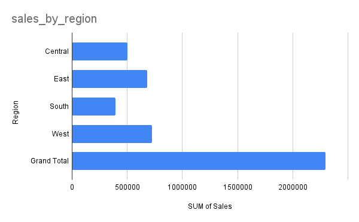

# Superstore Sales Analysis

## 📌 Objective
To analyze Superstore sales data (10k+ records) and identify insights about regional performance, product categories, monthly trends, and top products.

## 🛠 Tools Used
- Google Sheets / Excel  
  (Data cleaning, pivot tables, charts)

## 📊 Steps Performed
1. Imported dataset (~9,995 sales records).  
2. Cleaned the data:  
   - Added helper columns (OrderCount, Year, Month)  
   - Formatted dates for analysis  
3. Built pivot tables and charts:  
   - Sales by Region (Bar chart)  
   - Profit by Category (Column chart)  
   - Monthly Sales Trend (Line chart)  
   - Top 10 Products by Sales (Column chart)  

## 🔑 Insights
- **West region** generated the highest sales.  
- **Technology** category was the most profitable.  
- Clear **seasonal spikes** in sales around year-end (Nov–Dec).  
- Top products drove a significant share of overall revenue.  

## 📂 Files
- `Superstore_Sales_Analysis.xlsx` → cleaned data, pivots, charts  
- `screenshots/` → exported charts for quick view  

## 📸 Visuals
### Sales by Region

### Profit by Category

### Monthly Sales Trend

### Top 10 Products by Sales

---

## 📊 Power BI Dashboard – Superstore Sales Analysis

After completing the Excel-based analysis, I built an **interactive Power BI dashboard** using the same Superstore dataset to visualize key business insights dynamically.

### 🎯 Key Features
- KPI Cards for **Total Sales**, **Total Profit**, **Total Orders**, and **Average Order Value**
- Interactive **Slicers** for Year, Quarter, and Region
- **Monthly Sales Trend** (line chart)
- **Sales by Region** (bar chart)
- **Profit by Category** (column chart)
- **Top 10 Products by Sales** (horizontal bar chart)

---

### Dashboard

📁 **Power BI File:** [Superstore_Sales_Dashboard.pbix](Powerstore_Sales_Dashboard.pbix)

---

### 🖼️ Dashboard Preview

---

### 🧠 Tools & Skills Demonstrated
- **Power BI** – Dashboard design, data modeling, and interactivity  
- **DAX** – Calculated measures for KPIs and trend metrics  
- **Excel** – Data cleaning, transformation, and export  
- **Storytelling** – Business insights communicated via visuals

---

### 💡 Insights from Power BI Dashboard
- West region still dominates sales, confirming Excel analysis  
- Technology continues to drive highest profits  
- Clear seasonal pattern visible in Q4 months  
- Enhanced visualization provides deeper understanding of trends

---

### 🧩 Summary
> This project demonstrates the full **end-to-end data analysis workflow**:
> from raw Excel data cleaning → to Power BI dashboard visualization → to actionable insights.

